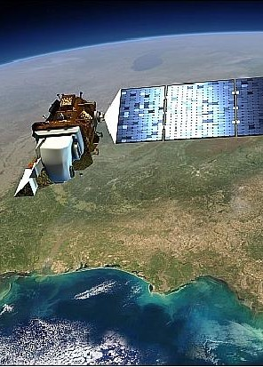
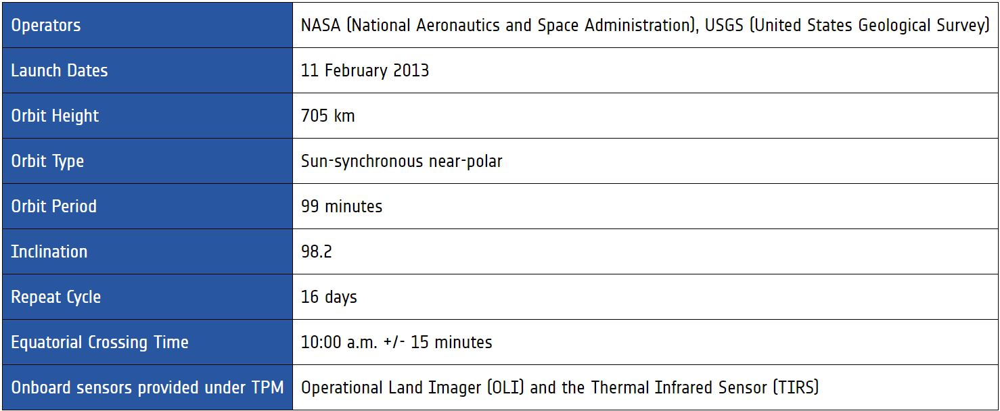
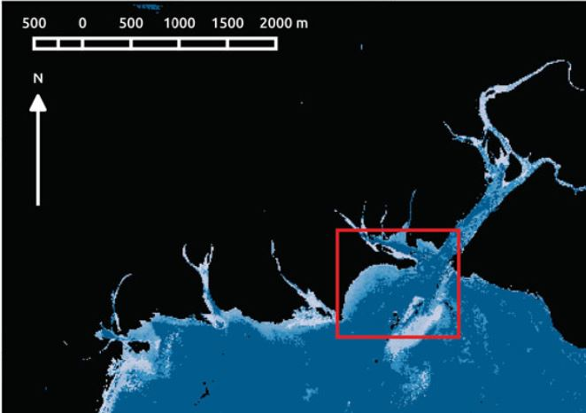
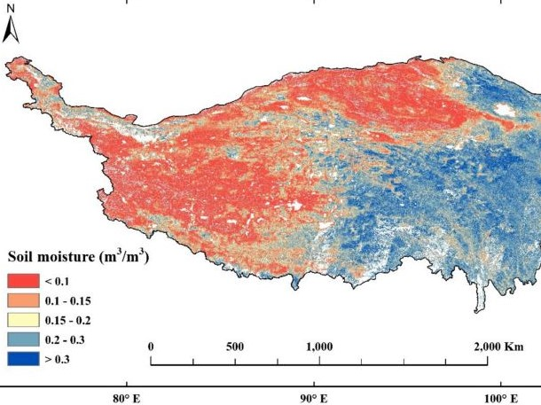
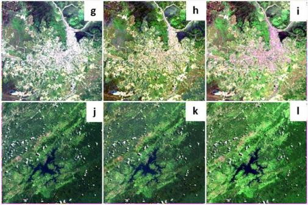
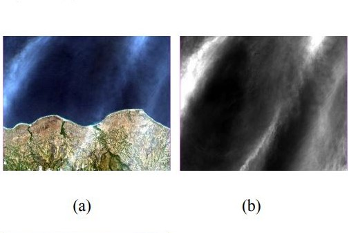
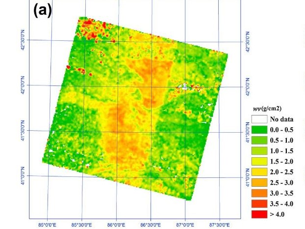
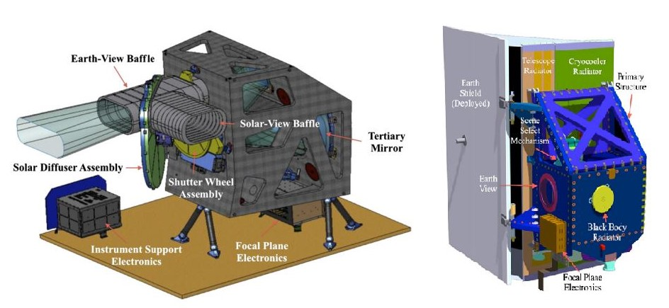

```{r include=FALSE}
library(RefManageR)
BibOptions(check.entries = FALSE,
           bib.style = "authoryear",
           cite.style = "authoryear",
           style = "markdown",
           hyperlink = TRUE,
           dashed = FALSE,
           no.print.fields=c("doi", "url", "urldate", "issn"))
myBib <- ReadBib("./rs_xaringan.bib", check = FALSE)
```

##Landsat 8 
.left-column[


[Source: NASA](https://landsat.gsfc.nasa.gov/article/landsat-8-at-five/)
]
.right-column[
Launched on 11 February, 2013 by NASA and USGS, Landsat 8 provides seasonal coverage of the global landmass with a 16-day repeat cycle.

Same as the previous Landsat satellites, Landsat 8 followed the second Worldwide Reference System (WRS-2) path as path/ row coordinate system, which is also referenced for ground processing and DPAS archive.


.right[[Source: esa](https://earth.esa.int/eogateway/missions/landsat-8)
]]

---
The advancement of Landsat 8 is the adoption of long, linear arrays in "push broom" manner, instead of "whiskbroom" imaging radiometers. The satellite carries two sensing instruments:

**1. Operational Land Imager (OLI)**
  - push-broom sensor with a four-mirror telescope and 12-bit quantization
  - collect data for all of the ETM+ shortwave bands to partially fulfill the data continuity mandate
  
**2. Thermal Infrared Sensor (TIRS)**
  - push broom sensor employing a focal plane with long arrays of photosensitive detectors
  - Replacing one wide spectral band on Landsats 4–7 by two TIRS bands
```{r echo=FALSE, out.width='70%', fig.align='center'}
knitr::include_graphics('img/Landsat 8 band designations.jpg')

```
.right[[Source: USGS](https://www.usgs.gov/media/images/landsat-8-band-designations)]
---

###Key Mission of Landsat 8
- Provide medium resolution multispectral image data
<br/>

- Ensure the consistency with data from the earlier Landsat missions
<br/>

- Distribute standard LDCM data products to  users on a nondiscriminatory and no cost basis
###Advantages
1. Open availability under Landsat Open Data Policy
<br/>

2. Improved imaging capacity for cirrus clouds detection, coastal zone observation and thermal imaging
<br/>

3. High acquisition rate benefits research in persistently cloudy areas
<br/>

4. Radiometrically and geometrically superior than previous Landsat missions due to improvement in:
  - Signal-to-noise ratios
  - Bandwidth properties
  - Geometric and geodetic accuracy
  
---
###Applications of Landsat 8
####Heritage Bands (Bands 2 - 8)
.left-column[
1. Bathymetric mapping
```{r echo=FALSE, out.width='100%', fig.align='left'}


```
<br/>
<br/>
<br/>
2. Soil Moisture
```{r echo=FALSE, out.width='100%', fig.align='left'}


```
]
.right-column[
- Use radiative transfer model inversion approach with bands 1-4 to map shallow bathymetry in Canada

- Create lookup table with above-surface reflectances and applied to creation of noise perturbed spectra

- Able to resolve shallow seafloor topography with reasonable seperation from deeper water

<br/>
- Develop machine learning algorithm to estimate soil moisture from 30m spatial resolution image

- Process VNIR and SWIR bands to orthorectified surface reflectance, and TIR band to orthorectified brightness temperature

- Show the potential to generate accurate soil moisture products globally at high spatial resolution
]
---
###Applications of Landsat 8
####New Spectral Bands (Bands 1 & 9)
.left-column[
1. Radiometric Enhancement
```{r echo=FALSE, out.width='100%', fig.align='left'}


```
<br/>
<br/>
<br/>
<br/>
2. Cirrus Correction
```{r echo=FALSE, out.width='100%', fig.align='left'}


```
]
.right-column[
- Enhance spectral value of OLI imagery by reducing the presence of aerosol particles using band 1

- Inspired by the Normalized Difference Spectral Index: using another band as sub-factor to enhance features 

- Develop practical formulations to reduce aerosol effect by exponential model without parameters  

<br/>
- Utilize band 9 to estimate cirrus effects on each pixel in visible bands using linear regression model

- By using image-based approach, regression model compute the cirrus intensity and recover cirrus-free digital number using band math

- Successfully correct cirrus cloud in Landsat 8 image of Sumba with increase in determination coefficients
]
---
###Applications of Landsat 8
####Thermal Infrared Bands (Bands 10 & 11)
.left-column[
1. Water Vapor Retrieval 
```{r echo=FALSE, out.width='100%', fig.align='left'}


```
<br/>
<br/>
<br/>
<br/>
2. Geothermal Anomalies 
```{r echo=FALSE, out.width='100%', fig.align='left'}
knitr::include_graphics('img/Capture_6.JPG')

```
]
.right-column[
- Estimate atmospheric water vapor from TIRS data of Landsat 8 and validated with 42 ground sites

- Apply the modified split-window covariance-varaince ratio method on the basis of the brightness temperatures of TIRS bands

- The method successfully retrieves water vapor and shows a high correlation with validation data 

<br/>
- Establish thermal infrared method for detection of geothermal areas with land surface temperature 

- Use long-term inversion data based on mono-window algorithm to identify ground hotspots

- Reveal that the distribution of geothermal anomaly areas are highly consistent with geological features
]
---
###Reflection
####Considerations When Selecting Sensor
1. Information about sensor's specifications are good indication to have an overview of the frequency of data collection and resolution of image.

2. Scenes per day of image data is a vital parameter to determine the suitability to the study. A high data acquisition rate significantly benefits studies in persistently cloudy area by reducing the time of collecting cloud-free pixel coverage.

3. User should identify the characteristics and advantages of sensor by understanding the types of bands, wavelength and spatial resolution. Detailed discussion from publications may also provide further information on requirements, specifications, design considerations, and performance in pre- and post-launch.

.pull-left[Design of Landsat 8 OLI (left) and TIRS (right)  ( , )]
.pull-right[
```{r echo=FALSE, out.width='90%', fig.align='right'}


```
]
---
###Reflection
####Data Usage
1. Consider the characteristics of each spectral band and how they allows different applications, such as applying solely according to spectral signifiance of features and using various band combinations for specific purpose of analysis

2. Integrate the application of bands by adopting available spatial indices with band math, or based on available indices to develop a new formula with other factors (e.g. Radiometric Enhancement with band 1)

####Future Applications
1. Medium spatial resolution datasets can be combined with very high-resolution (VHR) multispectral imageries due to their larger spatial coverage. An example is the application of Landsat data with VHR (e.g. WV-2, IKONOS and GeoEye-1) in the generation of high spatial resolution fractional cover maps for larger geographical areas.

2. Spectral signatures of Landsat satellite images can also apply with terrestrial lidar to quantify forest structure attributes with three-dimensional point data.
---
##Refernce List
```{r include=FALSE}
PrintBibliography(myBib, start = 1, end = 7)
```


```{r xaringan-themer, include=FALSE, warning=FALSE}
library(xaringanthemer)
style_mono_accent(
  base_color = "#1c5253",
  header_font_google = google_font("Josefin Sans"),
  text_font_google   = google_font("Montserrat", "300", "300i"),
  code_font_google   = google_font("Fira Mono")
)
```
